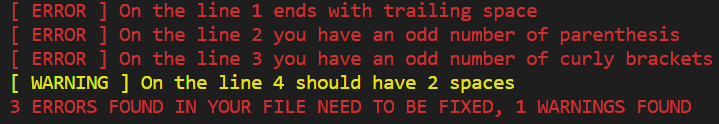

## Ruby linter
> Ruby capstone project
## Description

The aim of this project is to create my own linter file which is gonna detect errors inside the user's code and display messages with detail about the error, it checks:

- Indentation : A correct indentation is supposed to be 2 lines.
- Missing parenthesis/brackets/curly brackets : To prevent bugs.
- Lines with trailing spaces.
- Multiple empty lines.
- A missing empty line at the end of the file
- Unclosed block.

The linter returns errors and warning depending to the level of the issue in this format 


## Project Structure

This project includes the following files:

    ├──.github
    ├── gitflows
        ├── linters.yml
        ├── tests.yml
    ├── bin
    │   ├── main.rb
    └── lib
    │   ├── modules
    │   │   ├── checker_module.rb
    │   │   ├── file_reader.rb
    │   ├── checker.rb
    │   └── error_handler.rb
    ├── images
    ├── ├── capst.PNG
    ├── spec
    │   ├── checker_spec.rb
    │   ├── file_reader_spec.rb
    │   ├── checker_module_spec.rb
    │   ├── error_handler_spec.rb
    │   ├── spec_helper.rb
    ├── .gitignore
    ├── .rspec
    ├── test_correct.rb
    ├── test_bug.rb
    ├── bad_extension.txt
    ├── README.md

## Rules

> Here are some examples of bad / good code to be checked 

**_Indentation. (indentation set to 2)_**

> Bad code:

```
def something
return true if something_else
end
```

> Good code:

```
def something
  return true if something_else
end
```

**_Missing Parenthesis/Brackets/Curly Brackets_**

> Bad code:

```
(x + y) * (z - w
```

> Good code:

```
(x + y) * (z - w)
```

**_Lines with trailing spaces_**
>> The | symbol shows where the line ends

> Bad code:

```
if bad?     |
```

> Good code:

```
if !bad?|
```

**_Multiple empty lines_**

> Bad code:

```
end


if something...
```

> Good code:

```
end

if something...
```

**_A missing empty line at the end of the file_**

> Bad code:

```
end
```

> Good code:

```
end

```

**_Unclosed block_**

> Bad code:

```
def
  some awesome code


if something ...
```

> Good code:

```
def
  some awesome code
end

if something
```

# GET STARTED

**Prerequisits**

- Install at least one code editor 
- Install Ruby to execute the project
- [optional]:Install Rspec 

**clone the repository**

- Run `$ git clone https://github.com/pacyL2K19/my_ruby_linter.git`
- go to the project directory `$ cd my_ruby_linter`
- Run the command `$ ruby bin/main.rb`

> The last command will ask you to put file path to the file you want to check

*Put* : 
- `test_correct.rb` : To check the sample file provided which doesn't contain any error or warning
- `test_bug.rb` : To check a wrong sample file which contains errors and warnings
- `bad_extension.txt` : To check a no-Ruby file and see error message
- `something_bad.random` : To check the unexistant file 
# Original project idea and specifications

Please [click here](https://www.notion.so/microverse/Build-your-own-linter-b17a3c22f7b940c98ca1980250720769) to see the project specifics.

## Author

👤 **Pacifique Linjanja**

- Github: [@pacyL2K19](https://github.com/pacyL2K19)
- Twitter: [@PacifiqueLinja1](https://twitter.com/PacifiqueLinja1)
- Linkedin: [Pacifique Linjanja](https://www.linkedin.com/in/pacifique-linjanja/)


## 🤝 Contributing

Contributions, issues and feature requests are welcome!

Feel free to check the [issues page](https://github.com/pacyL2K19/my_ruby_linter/issues).

## Show your support

Give a ⭐️ if you like this project!

## License

This project is [MIT](lic.url) licensed.
